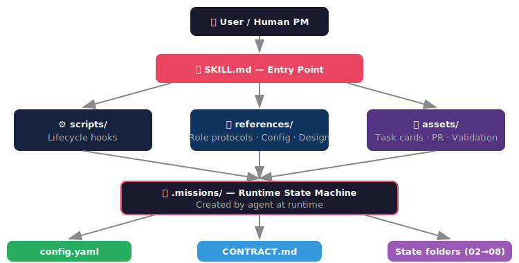
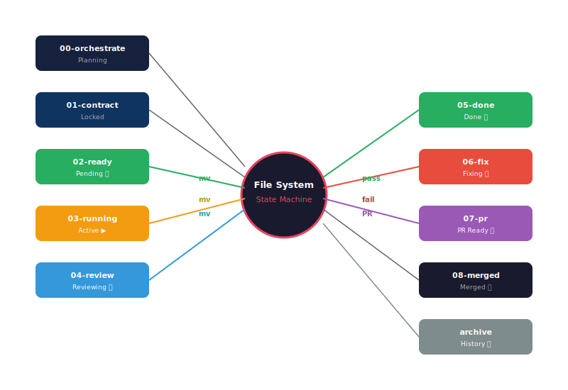

<div align="center">

# 🚀 Missions

**多智能体软件工程框架**

*文件系统状态机 · 角色分离 · 预锁定验证合约 · TDD 强制执行*

[](LICENSE)
[](https://agentskills.io)
[]()
[]()

</div>

---

## 什么是 Missions？

Missions 将一个 AI 助手转变为**自管理的工程团队**，包含四个不同角色：

| 角色 | 职责 |
|------|------|
| 🧠 **编排者 Orchestrator** | 规划目标、拆解任务、锁定验证合约 |
| 🔧 **工人 Worker** | 用 TDD 实现功能，每次使用全新上下文 |
| 🕵️ **验证者 Validator** | 独立验证实现，不接触实现细节 |
| 📝 **PR 作者 PR Author** | 汇总证据生成可读的 PR 描述 |

> **核心理念**：*"文件夹即状态机，Markdown 即指令，文件移动即状态转移。"*

---

## 架构

<div align="center">
  
</div>

---

## 状态机

<div align="center">
  
</div>

### 状态转移

```
02-ready/     ──[Worker 领取]─────▶  03-running/    (进行中，同时最多1个)
03-running/   ──[Worker 完成]─────▶  04-review/     (等待验证)
04-review/    ──[Validator 通过]──▶  05-done/       (已完成)
04-review/    ──[Validator 不通过]─▶  06-fix/ + archive/  (需修复)
06-fix/       ──[Worker 修复]─────▶  04-review/     (重新审查)
05-done/      ──[里程碑完成]──────▶  07-pr/         (PR Author 生成 PR)
07-pr/        ──[人工合并]────────▶  08-merged/     (归档)
```

---

## 核心原则

1. **串行写入，并行读取** — 文件写入和 git 提交串行化；研究、阅读可并行
2. **无长期记忆** — 智能体不依赖对话历史，所有上下文通过文件传递
3. **合约预锁定** — 验证标准在代码**之前**写好，杜绝事后补测试
4. **绝对分离** — Worker 和 Validator 是不同的"角色"，Validator 看不到 Worker 的推理过程
5. **经验预加载** (v1.1) — 每个角色在执行任务前自动加载相关历史经验，避免重复踩坑、复用已验证的模式
6. **自我改进循环** (v1.1) — 每次任务完成后，智能体审查已记录的经验以持续改进：规避过往阻塞、复用成功模式、优化 token 使用

---

## 快速开始

### 1. 安装

将 skill 目录复制到你的项目中：

```bash
# Claude Code
cp -r missions/ .claude/skills/missions

# 跨客户端兼容
cp -r missions/ .agents/skills/missions
```

### 2. 调用

在智能体输入 `/missions`，或自然地描述你的目标：

```
我想构建一个带 OAuth2 登录和用户管理的 FastAPI 服务
```

### 3. 回答澄清问题

编排者会问最多 3 个问题（如数据库选型、认证方式）。回答后**退后一步**——智能体会处理其余所有工作。

### 4. 合并 PR

当智能体报告「PR 就绪」时，在 GitHub 上创建 PR 并合并，然后归档：

```bash
mv .missions/07-pr/PR-*.md .missions/08-merged/
```

---

## ✨ v1.1 新增功能

| 功能 | 说明 |
|------|------|
| 🔄 **REACTIVATION 协议** | 智能体崩溃恢复与会话重启 — 中断的工作流可无缝恢复 |
| 🛡️ **安全审计角色** | 新增内置角色，用于认证/加密/支付功能的安全审查 |
| 📝 **上下文编写角色** | 新增可扩展角色，用于生成项目文档和知识产物 |
| 📊 **审计模板** | 结构化的安全与质量审计报告模板 |
| 🎯 **经验系统** | 经验卡片（模板 + 索引 + 示例）用于记录经验教训 |
| 📈 **指标追踪** | 量化成功指标模板，用于衡量项目成果 |
| ✅ **启动检查清单** | 项目初始化检查清单，确保一致的项目设置 |
| 🚑 **恢复序列** | 增强的 WORKFLOW.md，包含回滚和重启转移序列 |
| 🧩 **示例经验** | EXP-SEED-001/101/201 示例经验卡片 |

---

## 人工介入点

你只需要在 **6 个时机** 介入：

| 时机 | 操作 |
|------|------|
| 🟢 **启动时** | 提供项目目标 |
| 💬 **澄清时** | 回答编排者的 1–3 个问题 |
| ⏸️ **任务卡住** | `mv .missions/03-running/X.md .missions/02-ready/` |
| 🔀 **合并 PR** | 审查 PR，在 GitHub 创建 PR，合并，归档 |
| 📖 **审查经验** | 任务完成后，查看 `.missions/logs/experience/` 验证学到的模式 |
| 🔄 **重启任务** | 直接告诉智能体恢复 — 它会自动检测状态并加载经验 |

其他所有事情都是**自动完成**的。

---

## 配置

创建 `.missions/config.yaml` 自定义行为：

```yaml
project:
  name: my-api
  language: python
  framework: fastapi

roles:
  worker:
    enforce_tdd: true
    min_coverage: 80
    allowed_linters: [ruff, mypy]
  validator:
    strict_mode: true
    run_e2e: true
```

### 配置层级

```
内置默认值 (在 AGENTS.md 中)
    │
    ▼ 覆盖
config.yaml (skill 包默认)
    │
    ▼ 覆盖
config.local.yaml (用户自定义，已 gitignore)
    │
    ▼ 覆盖
环境变量 (如 MISSIONS_WORKER_MIN_COVERAGE=90)
```

---

## 文件结构

### Skill 包

```
missions/                          ← skill 根目录
├── SKILL.md                       ← 入口文件 + 清单
├── scripts/
│   └── bootstrap.sh               ← 环境引导
├── references/
│   ├── AGENTS.md                  ← 角色协议（4 + 2 可扩展角色）
│   ├── CONFIG.md                  ← 配置指南
│   ├── PRINCIPLE.md               ← 设计哲学
│   ├── REACTIVATION.md            ← 崩溃恢复与重启协议
│   ├── WORKFLOW.md                ← 状态机 + 恢复序列
│   └── examples/
│       └── experience/            ← 示例经验卡片
├── assets/
│   ├── feature-template.md        ← 任务卡片模板
│   ├── fix-template.md            ← 修复卡片模板
│   ├── pr-template.md             ← PR 描述模板
│   ├── validation-template.md     ← 验证报告模板
│   ├── audit-template.md          ← 安全/质量审计模板
│   ├── experience-template.md     ← 经验卡片模板
│   ├── experience-index-template.md
│   ├── metrics-template.md        ← 成功指标追踪
│   └── startup-checklist.md       ← 项目初始化检查清单
└── README.zh-CN.md                ← 本文件
```

### 运行时（由智能体生成）

```
.missions/                         ← 在你的项目根目录创建
├── config.yaml                    ← 用户配置
├── AGENTS.md                      ← 角色协议（复制版）
├── CONTRACT.md                    ← 锁定的验证合约
├── README.md                      ← 实时状态仪表盘
├── 00-orchestrate/                ← 规划草稿
├── 01-contract/                   ← 锁定合约存档
├── 02-ready/                      ← 待办任务卡片
├── 03-running/                    ← 进行中任务（最多1个）
├── 04-review/                     ← 待验证
├── 05-done/                       ← 已完成
├── 06-fix/                        ← 待修复
├── 07-pr/                         ← PR 描述
├── 08-merged/                     ← 已合并
├── logs/                          ← v1.1: 审计追踪与学习
│   ├── audit/*.md                 ← 执行历史
│   ├── metrics/*.yaml             ← 性能数据
│   └── experience/*.md            ← 学到的模式 (INDEX.md + 卡片)
└── archive/                       ← 历史记录
```

---

## 渐进式加载

遵循 [agentskills.io](https://agentskills.io) 规范，保持智能体上下文精简：

| 层级 | 内容 | 大小 | 加载时机 |
|------|------|------|----------|
| 1 | `name` + `description` | ~100 tokens | 启动时 |
| 2 | SKILL.md 主体 | ~3000 tokens | Skill 激活时 |
| 3 | `references/*.md`, `assets/*.md` | 不定 | 按角色按需加载 |

---

## 自定义级别

| 级别 | 操作 | 难度 |
|------|------|------|
| 1 | 修改 `config.yaml` | ⭐ 简单 |
| 2 | 覆盖 `assets/` 模板 | ⭐⭐ 中等 |
| 3 | 在 `AGENTS.md` 添加自定义角色 | ⭐⭐⭐ 高级 |
| 4 | 在 `scripts/` 添加生命周期钩子 | ⭐⭐⭐ 高级 |
| 5 | 修改 `WORKFLOW.md` 状态机 | ⭐⭐⭐⭐ 专家 |

---

## 跨平台兼容

| 平台 | 支持 | 调用方式 |
|------|------|----------|
| [Claude Code](https://docs.anthropic.com/en/docs/claude-code/overview) | ✅ 原生支持 | `/missions` 或自动检测 |
| [OpenClaw](https://github.com/openclaw) | ✅ 原生支持 | `openclaw skill install missions` |
| Cursor Agent | ✅ 兼容 | 复制 `.claude/skills/missions/` 到项目 |
| VS Code + Continue | ✅ 兼容 | 自定义 prompt 加载 |
| GitHub Copilot Chat | ⚠️ 部分支持 | 手动复制模板 |

---

## 排错指南

| 症状 | 原因 | 修复 |
|------|------|------|
| 智能体不自动路由 | SKILL.md 未加载 | 确保 skill 在 `.claude/skills/missions/` 或调用 `/missions` |
| CONTRACT 未锁定 | Orchestrator 未完成 | 回答所有澄清问题 |
| Worker 卡住 | 任务太大 | 在 config 中减小 `max_lines_per_feature` |
| Validator 漏检 | `strict_mode` 关闭 | 设置 `roles.validator.strict_mode: true` |
| 未生成 PR | 里程碑未完成 | 等待所有功能进入 `05-done/` |

---

## 重新启动任务 (v1.1)

智能体可以**自动恢复**被中断的任务 — 无需手动重新初始化。

```bash
# 只需告诉智能体：
/resume
# 或描述要继续什么：
继续之前进行中的 worker 任务
```

智能体会自动：
1. 检测已存在的 `.missions/` 状态
2. 读取 `.missions/logs/experience/INDEX.md` 获取历史上下文
3. 根据文件夹状态确定当前状态（03-running → 恢复 Worker，04-review → 恢复 Validator 等）
4. 加载与当前任务类型相关的经验记录
5. 从中断处继续执行

```bash
# 查看将要应用的经验
cat .missions/logs/experience/INDEX.md
```

### 重启时不要做的事

- ❌ **不要**重新运行 `/missions` — 这会触发全新的初始化流程
- ❌ **不要**手动重新锁定 CONTRACT.md — 锁定后不可更改
- ❌ **不要**在状态文件夹之间移动文件 — 让智能体处理状态转换

---

## 审计与经验系统 (v1.1)

Missions v1.1 引入了结构化的学习系统：

### 审计追踪

每次角色执行都会记录到 `.missions/logs/audit/`：

```bash
# 查看最新审计条目
cat .missions/logs/audit/latest.md
```

### 经验系统

经验系统捕获经验教训和可复用的模式：

- **经验卡片** — 结构化的 markdown 文件，存放在 `.missions/logs/experience/`
- **INDEX.md** — 可搜索的所有经验索引，包含严重性、类别和相关性标签
- **预加载** — 每个角色在执行任何任务前自动读取相关经验
- **自我改进** — 每次任务完成后，智能体审查经验以避免过往阻塞并复用成功模式

### 自我改进循环

每次任务完成后，智能体读取 `logs/experience/` 以：
- 避免之前遇到的阻塞问题
- 复用成功的实现模式
- 应用已验证的修复策略
- 基于历史数据优化 token 使用

---

## 设计哲学

Missions 不是为了把智能体变得更聪明。而是让它变得**可问责**——每个决策、每个测试、每个缺陷修复都记录在结构化的、可审计的文件中。

> **"配置即代码，模板即协议，钩子即扩展。"**
>
> — Missions Skill 设计哲学

### 对比：原版 vs agentskills.io 版

| 维度 | 原版 Missions | Missions Skill (v1.1) |
|------|--------------|----------------------|
| 规范 | 无 | ✅ **agentskills.io** 兼容 |
| 配置 | 无 | ✅ **config.yaml** 驱动 |
| 模板 | 硬编码 | ✅ **可覆盖** assets/（10 个模板） |
| 角色 | 3 个固定 | ✅ **4 + 2 可扩展**（安全审计、上下文编写） |
| 钩子 | 无 | ✅ **scripts/** 生命周期 |
| 恢复机制 | 无 | ✅ **REACTIVATION.md** 崩溃恢复协议 |
| 经验系统 | 无 | ✅ **经验卡片**（模板 + 索引 + 示例） |
| 跨平台 | 仅 Claude Code | ✅ **多平台** |
| 渐进式加载 | 无 | ✅ **3 级加载** |

---

## 许可

[MIT](LICENSE)

## 更新日志

- **v2.0.0** (2026-06-30): Claude修订版. 状态检测移至 config/experience 读取之前（按角色过滤）。PR Author 触发改为 `coverage_map` key → feature ID 精确匹配。Orchestrator 提问优先级排序（Q1: milestone 范围 → Q2: 断言影响 → Q3: 工具细节）。Worker "Fresh start" 改为 "File-scoped context"。新增 `assets/contract-template.md`。Fix card 模板加入 `root_feature`/`fix_number`/层次化 parent 追踪。RESTART 章节从 SKILL.md 剥离至 REACTIVATION.md。Experience Curator 严重度阈值：critical 首次即记录，major/minor 需≥2次。`bootstrap.sh` 自动 seed 经验库和合约模板。
- **v1.1.0** (2026-06-29): 新智能体协议。新增 REACTIVATION.md 崩溃恢复、
  审计/经验/指标/启动检查清单模板、安全审计与上下文编写角色、
  增强的 WORKFLOW.md 恢复/重启序列、示例经验卡片。
- **v1.0.0** (2026-06-28): 初始发布。四个角色、文件系统状态机、PR 工作流、agentskills.io 兼容。
